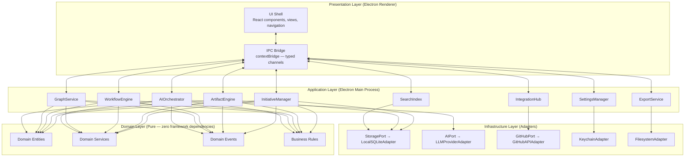

<!-- Source: architect skill | Phase 5 | Date: 2026-07-02 -->
<!-- Last updated: 2026-07-02 -->

# Component List

All components are organized into four layers: Presentation, Application, Domain, and Infrastructure.

See [../decisions/ADR-002-clean-architecture.md](../decisions/ADR-002-clean-architecture.md) for the architectural pattern rationale.

---

## Component Architecture Diagram

---

## Component Responsibilities

### Presentation Layer

| Component | Responsibility |
|-----------|---------------|
| **UI Shell** | All React views, navigation, state display, and user interaction. Runs in sandboxed Electron renderer. |
| **IPC Bridge** | Typed, sandboxed Electron `contextBridge` — the only crossing point between renderer and main process. No direct Node.js access from renderer. |

### Application Layer

| Component | Responsibility |
|-----------|---------------|
| **InitiativeManager** | Create, list, archive, and delete Initiatives; enforce Initiative-level invariants (e.g., block deletion of Initiatives with Approved artifacts). |
| **ArtifactEngine** | Manage artifact content, status transitions (Draft → Approved → NeedsReview), and artifact-level history. |
| **WorkflowEngine** | Enforce artifact dependency order, trigger approval gate warnings, propagate `NeedsReview` cascades when upstream artifacts are edited after approval. |
| **GraphService** | Manage the engineering graph — add, remove, and query typed directed relationships between artifacts. Enforces DAG invariant (no cycles). |
| **AIOrchestrator** | Route AI requests to the configured provider adapter, capture AI Sessions, attach generated drafts to artifacts for review. |
| **ExportService** | Produce structured Markdown exports of artifacts or full Initiatives; manage backup/restore of the full data directory. |
| **IntegrationHub** | Isolated, optional module for all external push integrations. GitHub Issues (v1). New integrations are added here without touching other components. |
| **SearchIndex** | Maintain and query a full-text index over all artifact content. Returns ranked results with artifact location context. |
| **SettingsManager** | Manage user configuration, AI provider credentials (via KeychainAdapter), and application preferences. |

### Domain Layer

| Component | Responsibility |
|-----------|---------------|
| **Domain Entities** | The core objects: Initiative, Artifact, ADR, Task, AISession, ArtifactRelationship. Contain business rules and invariants. |
| **Domain Services** | Logic that spans multiple entities: graph invariant checking, dependency resolution, downstream cascade calculation. |
| **Domain Events** | Immutable records of things that happened: `ArtifactApproved`, `ADRAccepted`, `DependencyGateWarningTriggered`, etc. |
| **Business Rules** | Explicit invariants: ADR content immutability after Accepted, no orphan tasks, NeedsReview propagation, no duplicate ADR numbers. |

### Infrastructure Layer

| Component | Responsibility |
|-----------|---------------|
| **StoragePort → LocalSQLiteAdapter** | Persistence abstraction. v1 implements with SQLite + `better-sqlite3`. v2 can introduce `CloudStorageAdapter` or `PostgreSQLStorageAdapter` without domain changes. |
| **AIPort → LLMProviderAdapter** | Provider-agnostic AI interface. New AI providers are new adapter implementations — zero application or domain changes. |
| **GitHubPort → GitHubAPIAdapter** | One-way GitHub Issues push. Isolated from all other components via the IntegrationHub. |
| **KeychainAdapter** | Cross-platform OS keychain access via `keytar`. API keys are never stored in plaintext. |
| **FilesystemAdapter** | File write operations for Markdown export and backup files. |

---

## Data Ownership

| Component / Module | Owns |
|-------------------|------|
| **InitiativeManager** | Initiative metadata and lifecycle |
| **ArtifactEngine** | Artifact content, status, and version history |
| **GraphService** | ArtifactRelationship edges and graph integrity |
| **AIOrchestrator** | AISession records |
| **SettingsManager** | User preferences and provider configuration |

**Rule:** No component reads or writes data owned by another component directly. All cross-component data access goes through defined interfaces.

---

*See [domain-model.md](domain-model.md) for entities, value objects, and business rules.*  
*See [system-context.md](system-context.md) for the external view.*
