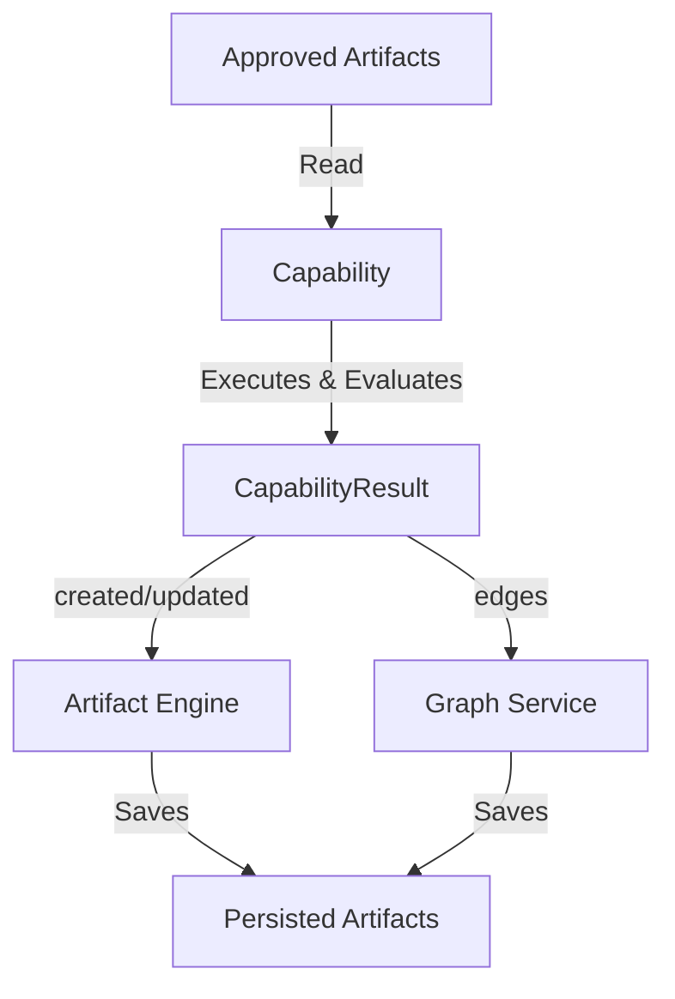
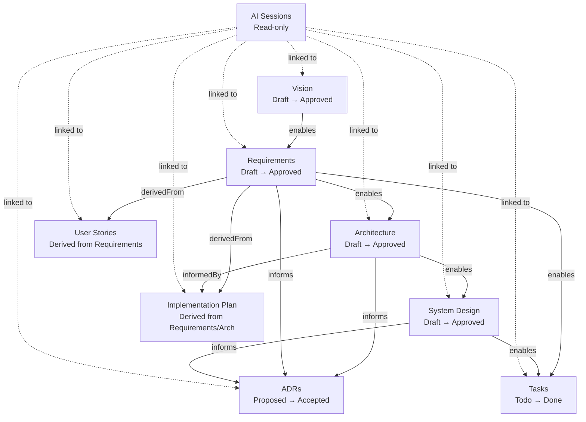

<!-- Source: architect skill | Phase 5 | Date: 2026-07-02 -->
<!-- Last updated: 2026-07-02 -->

# Domain Model

Forge's domain has genuine complexity warranting Clean Architecture and selective DDD tactical patterns applied to the core modules (Artifact lifecycle, WorkflowEngine, GraphService). Simpler modules (Settings, Export, Search) use thin services without domain modeling overhead.

See [../decisions/ADR-002-clean-architecture.md](../decisions/ADR-002-clean-architecture.md) for the methodology rationale.

---

## Entities

| Entity                   | Aggregate Root?          | Key Attributes                                                                                                                  | Key Invariants                                                                                                                                                                   |
| ------------------------ | ------------------------ | ------------------------------------------------------------------------------------------------------------------------------- | -------------------------------------------------------------------------------------------------------------------------------------------------------------------------------- |
| **Initiative**           | ✅ Yes                   | id, name, description, status, createdAt, updatedAt                                                                             | Cannot be hard-deleted if any artifact is Approved (requires explicit double-confirmation)                                                                                       |
| **Artifact**             | No (child of Initiative) | id, initiativeId, type, content, status, version, generatedByCapabilityId, generationSessionId, createdAt, updatedAt            | Status transitions: Draft → Approved → NeedsReview (on upstream edit). Editing Approved artifact cascades NeedsReview downstream. Provenance is immutable history.               |
| **Finding**              | No (child of Artifact)   | id, artifactId, severity, category, message, recommendation, capabilityId, createdAt                                            | Findings are immutable evaluation results produced by validation capabilities. They describe issues, recommendations, or observations without modifying the evaluated artifacts. |
| **ADR**                  | No (child of Initiative) | id, initiativeId, sequentialNumber, title, status, context, decision, consequences, alternatives, supersededById                | Content is immutable once status = Accepted. sequentialNumber never reused within an Initiative.                                                                                 |
| **Task**                 | No (child of Initiative) | id, initiativeId, title, description, status, priority, requirementId (required), systemDesignRef (optional), githubIssueNumber | Must be linked to at least one Requirement — no orphan tasks.                                                                                                                    |
| **AISession**            | No (child of Initiative) | id, initiativeId, artifactId, name, prompt, response, acceptedContent, createdAt                                                | Read-only after creation. Cannot be deleted if linked artifact is Approved (only archivable).                                                                                    |
| **ArtifactRelationship** | No (Graph Module)        | id, sourceArtifactId, targetArtifactId, relationshipType, createdAt                                                             | No duplicate relationships. No self-relationships. No cycles (DAG invariant).                                                                                                    |

---

## Value Objects

| Value Object         | Values                                                                                                  | Notes                                             |
| -------------------- | ------------------------------------------------------------------------------------------------------- | ------------------------------------------------- |
| **ArtifactType**     | Vision, Requirements, Architecture, SystemDesign, UserStories, ImplementationPlan, ADR, Task, AISession | Immutable after artifact creation                 |
| **ArtifactStatus**   | Draft, Approved, NeedsReview                                                                            | Drives gate logic in WorkflowEngine               |
| **ADRStatus**        | Proposed, Accepted, Deprecated, Superseded                                                              | Only status changes allowed after Accepted        |
| **TaskStatus**       | Todo, InProgress, Done, Blocked                                                                         | No business invariants — user-controlled          |
| **InitiativeStatus** | Discovery, InProgress, Released                                                                         | Derived from artifact states — never manually set |
| **MoSCoWPriority**   | MustHave, ShouldHave, CouldHave, WontHave                                                               | Applied to Requirements artifacts                 |
| **RelationshipType** | DerivedFrom, InformedBy, DecidedBy, Implements, Generated, SupersededBy                                 | Typed edges in the engineering graph              |

---

## Execution Contracts

### CapabilityResult<T>

**Purpose:** Standard execution boundary between capabilities and the EngineeringAgent orchestration layer.

Contains:

- `createdArtifacts: Artifact[]`
- `updatedArtifacts: Artifact[]`
- `graphEdgesCreated: ArtifactRelationship[]`
- `findings: Finding[]`
- `warnings: string[]`
- `executionMetadata: Record<string, unknown>`

By acting as the singular return type, it removes workflow implementation details from the orchestration layer.

---

## Engineering Execution Model

This flow demonstrates the central execution pattern of Forge for every engineering discipline (Capability Pack).

1. **Approved Artifacts** serve as the strict inputs to the workflow.
2. The **Capability** performs a deterministic transformation, enforcing domain-layer approval gates (e.g. failing if parent artifacts aren't Approved).
3. The Capability yields a **CapabilityResult**, separating the evaluation from the side effects.
4. The orchestration layer drives the **Artifact Engine** and **Graph Service** to record the changes.

---

## Domain Events

| Event                            | Trigger                                                     | Downstream Effect                                                                |
| -------------------------------- | ----------------------------------------------------------- | -------------------------------------------------------------------------------- |
| `ArtifactApproved`               | Artifact status → Approved                                  | Unblocks dependent artifact creation; recalculates Initiative status             |
| `ArtifactEditedAfterApproval`    | Approved artifact content changed                           | Propagates `NeedsReview` to all downstream Approved artifacts; user notified     |
| `DependencyGateWarningTriggered` | User attempts to approve artifact without approved upstream | UI warning displayed; user can confirm-override or cancel; decision is recorded  |
| `ADRAccepted`                    | ADR status → Accepted                                       | ADR content becomes immutable; ADR linked to specified artifacts                 |
| `ADRSuperseded`                  | New ADR created as replacement                              | Original ADR status → Superseded; `supersededById` populated; cross-link created |
| `TaskCreated`                    | Task derived from Requirement                               | ArtifactRelationship created: Task —[DerivedFrom]→ Requirement                   |
| `AISessionCaptured`              | AI interaction completed                                    | AISession record created; ArtifactRelationship: AISession —[Generated]→ Artifact |
| `InitiativeStatusUpdated`        | Artifact state changes                                      | Initiative status recalculated from artifact completion profile                  |

---

## Business Rules & Invariants

| Rule                                                                                                               | Enforcement Point                                                                 |
| ------------------------------------------------------------------------------------------------------------------ | --------------------------------------------------------------------------------- |
| ADR content is immutable once status = Accepted                                                                    | ADR entity setter — rejects content writes when Accepted                          |
| ADR sequential numbers are never reused within an Initiative                                                       | InitiativeManager on ADR creation                                                 |
| Tasks must be linked to at least one Requirement                                                                   | ArtifactEngine on Task creation/save                                              |
| Editing an Approved artifact cascades NeedsReview to all downstream Approved artifacts                             | WorkflowEngine on `ArtifactEditedAfterApproval` event                             |
| Approval gates are warnings, not hard blocks — user can override with explicit confirmation                        | WorkflowEngine returns `GateWarning`; UI presents confirmation; decision recorded |
| Initiatives cannot be permanently deleted while containing Approved artifacts without explicit double-confirmation | InitiativeManager                                                                 |
| AI Sessions are read-only after creation                                                                           | AISession entity — no update operation exposed                                    |
| AI Sessions linked to Approved artifacts cannot be deleted (only archived)                                         | AIOrchestrator / ArtifactEngine guard                                             |
| No cycles in the artifact relationship graph                                                                       | GraphService — enforces DAG invariant on every edge insertion                     |

---

## Artifact Dependency Graph

**Gate semantics:** An arrow means the source _should normally_ be Approved before the target is worked on. All gates are warning + confirmation-override — never a silent hard block.

---

## Ubiquitous Language (Glossary)

| Term                  | Definition                                                                                                                                            |
| --------------------- | ----------------------------------------------------------------------------------------------------------------------------------------------------- |
| **Initiative**        | A long-lived engineering workspace for a product, feature, migration, or research project. The primary object in Forge. Never truly "done."           |
| **Artifact**          | A discrete engineering document within an Initiative (Vision, Requirements, Architecture, System Design). Has its own lifecycle.                      |
| **ADR**               | Architecture Decision Record. An immutable (once Accepted) record of a significant engineering decision, its context, alternatives, and consequences. |
| **Task**              | An actionable implementation item derived from Requirements or System Design. The bridge between Forge and implementation tools.                      |
| **AI Session**        | A read-only record of an AI-assisted interaction — prompt, response, and what was accepted into an artifact.                                          |
| **Engineering Graph** | The directed, typed graph of relationships between all artifacts in an Initiative. Makes every decision traceable to its origin.                      |
| **Approval Gate**     | A workflow checkpoint. Upstream artifacts should normally be Approved before downstream work begins. Warnings, not hard blocks.                       |
| **NeedsReview**       | An artifact status set automatically when an upstream approved artifact is edited. Signals that the downstream artifact may no longer be valid.       |
| **StoragePort**       | The interface that abstracts all persistence. The domain and application layers never import a database driver directly.                              |
| **AIPort**            | The interface that abstracts all AI provider interactions. New providers are new adapters — no domain changes.                                        |

---

_See [component-list.md](component-list.md) for component responsibilities._  
_See [../decisions/ADR-006-artifact-graph-model.md](../decisions/ADR-006-artifact-graph-model.md) for the graph model decision._
