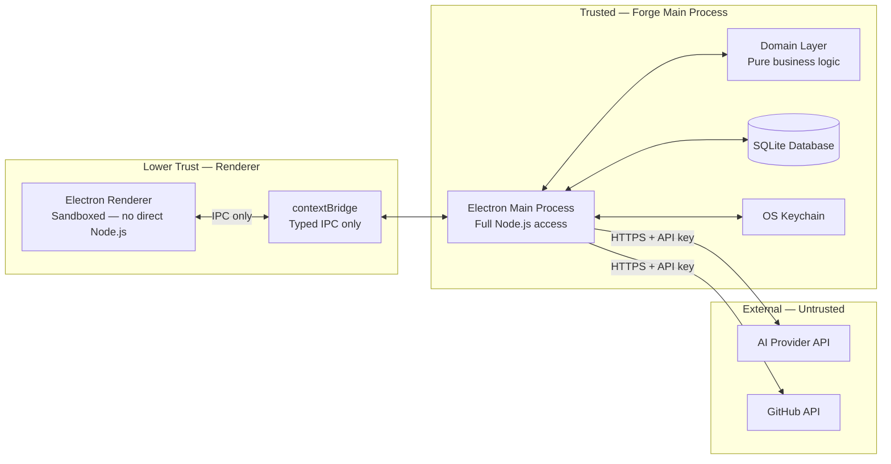

<!-- Source: architect skill | Phase 5 | Date: 2026-07-02 -->
<!-- Last updated: 2026-07-02 -->

# Security Model

Forge v1 is a local-first, single-user desktop application. The security model is deliberately minimal in v1 but must be designed so that cloud and multi-user features can be added in v2 without retrofitting security concerns.

---

## Data Classification

| Data Type | Sensitivity | Storage Location | Protection |
|-----------|------------|-----------------|------------|
| Initiative content (vision, requirements, architecture, decisions) | **Confidential** — user's intellectual property | Local SQLite database file | OS filesystem permissions. Encryption at rest TBD before any cloud feature ships. |
| AI Session content (prompts + responses) | **Confidential** — may contain sensitive architecture details | Local SQLite database file | Same as above. |
| AI provider API keys | **Restricted** — credentials | OS Keychain only | Never written to SQLite or any config file. Fetched from keychain immediately before use. |
| GitHub API tokens | **Restricted** — credentials | OS Keychain only | Same as API keys. |
| Application settings / preferences | **Internal** | `electron-store` / local config | Non-sensitive. |
| Markdown export files | **Confidential** (user-controlled) | User-chosen filesystem path | User is responsible for export security. Forge warns on export of sensitive content. |

---

## Authentication & Authorization (v1)

**v1 has no user authentication.** The application is single-user and local-only. Access control is provided entirely by the OS filesystem permissions on the Forge data directory.

- No login screen in v1.
- No session management in v1.
- No multi-user access control in v1.

**When cloud accounts are introduced (v2+):** A full auth design is required before any line of cloud code is written. Minimum requirements:
- Password hashing: bcrypt or Argon2
- Session management: JWT or secure session tokens
- GDPR-compliant consent and data handling
- Right to deletion and data export

---

## Trust Boundaries

**Trust rules:**
1. The renderer process has zero direct access to the filesystem, database, or OS APIs. All operations cross the typed IPC bridge.
2. AI provider and GitHub API calls are made exclusively from the main process, never from the renderer.
3. API keys are fetched from the OS Keychain immediately before use — never cached in memory beyond the immediate operation.
4. The IPC channel inventory is explicit and auditable. No wildcard IPC listeners.

---

## Compliance Posture

| Regulation | v1 Status | Trigger | Required Action |
|-----------|-----------|---------|----------------|
| **GDPR** | Not triggered in v1 | Any cloud sync, accounts, or EU user data transmission | Full GDPR design required before cloud feature ships: right to deletion, data export, consent record, data processing agreements |
| **CCPA** | Not triggered in v1 | California users + cloud/account features | Same trigger as GDPR |
| **SOC 2** | Not applicable in v1 | Enterprise team tier introduction | Revisit when team features are planned |
| **PCI-DSS** | Not applicable | Only if Forge handles payments directly | Use a payment processor (Stripe). Never handle raw card data. |

> **Standing rule:** No cloud feature ships without a completed GDPR compliance design review. This must be enforced as a gate in the v2 planning phase.

---

## Security Principles for Future Development

1. **Defence in depth.** Never rely on a single security control. Layer OS permissions, application-level validation, and encrypted storage.
2. **Least privilege.** The renderer process has only the capabilities it needs, explicitly declared in the IPC bridge.
3. **Secrets never in plaintext.** API keys and tokens live exclusively in the OS Keychain.
4. **No telemetry without consent.** Zero data is transmitted without explicit user opt-in.
5. **Cloud-readiness without cloud.** Data models must be designed with GDPR deletion and export in mind from the first day, even before any cloud feature is built.

---

*See [../decisions/ADR-007-electron-ipc-security.md](../decisions/ADR-007-electron-ipc-security.md) for IPC security decision.*  
*See [component-list.md](component-list.md) for component trust boundaries.*
