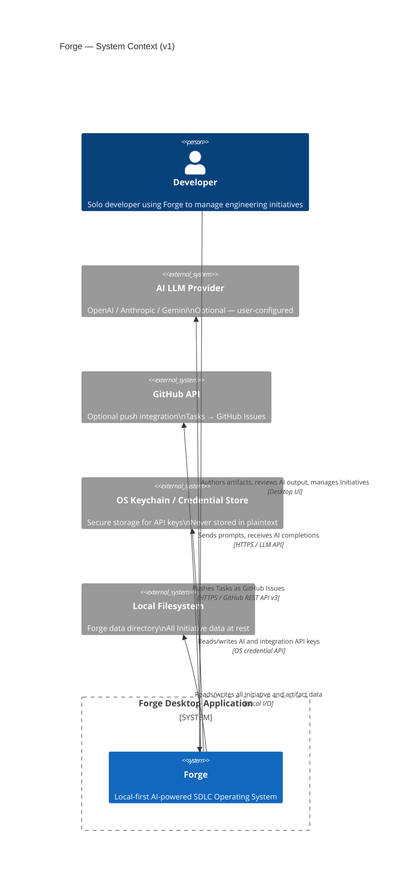

<!-- Source: architect skill | Phase 5 | Date: 2026-07-02 -->
<!-- Last updated: 2026-07-02 -->

# System Context

This diagram shows Forge as a black box and how it relates to external actors and systems.

---

## C4 Context Diagram

---

## External Systems

| System | Role | Forge Relationship |
|--------|------|--------------------|
| **Developer** | Primary user | Creates Initiatives, authors artifacts, reviews AI output |
| **AI LLM Provider** | Optional AI backend | Forge sends prompts; receives completions. User provides API key. |
| **GitHub API** | Optional push integration | One-way: Forge pushes Tasks as Issues. Never pulls. |
| **OS Keychain** | Secure credential store | Forge reads/writes API keys. Keys never written to disk in plaintext. |
| **Local Filesystem** | Persistence | All Initiative data lives in a single `.sqlite` file in the Forge data directory. |

---

## Key Design Boundaries

- **Forge does not own code.** Source files, Git repositories, CI pipelines, and deployment systems are entirely external.
- **Forge is push-only with integrations.** It outputs to GitHub Issues and Markdown exports. It does not pull state from external systems.
- **No cloud in v1.** All data lives on the local filesystem. No remote server communication except AI provider and GitHub API calls (both user-initiated, both optional).

---

*See [component-list.md](component-list.md) for internal component breakdown.*  
*See [../decisions/ADR-001-electron-delivery.md](../decisions/ADR-001-electron-delivery.md) for delivery mechanism decision.*
