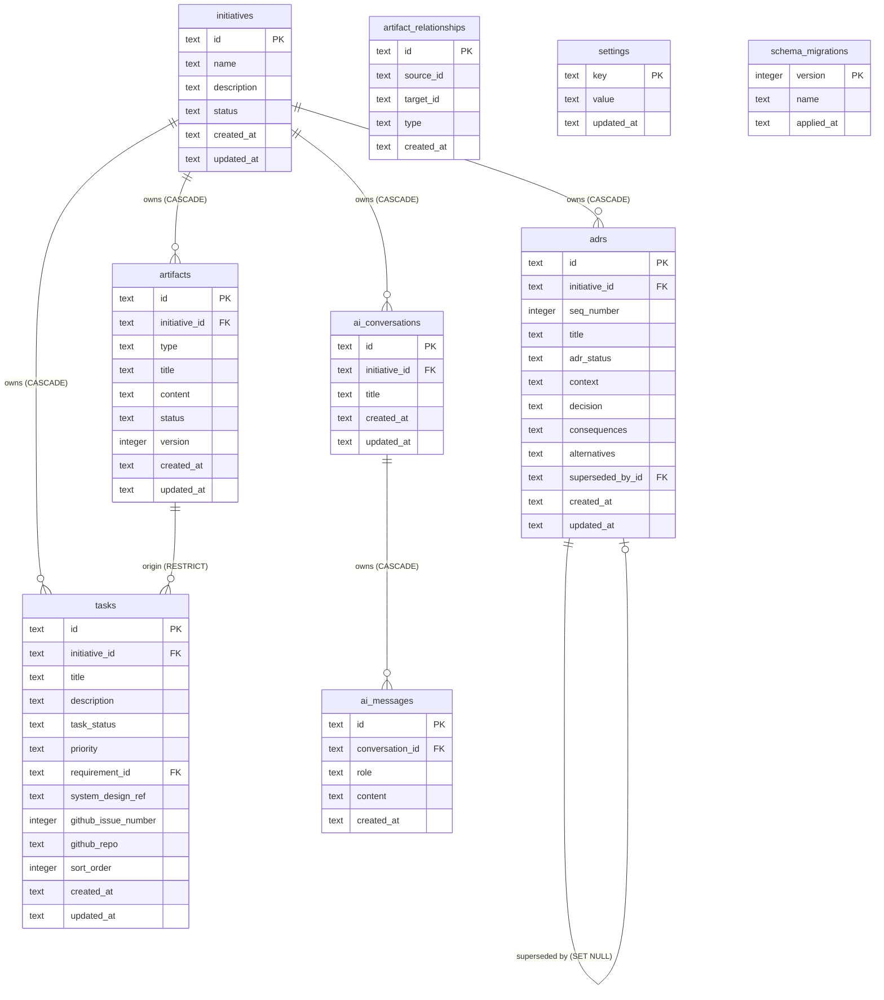

<!-- Source: database-design skill | Phase 7 | Date: 2026-07-02 -->
<!-- Last updated: 2026-07-02 -->

# Entity Relationship Diagram

Visual overview of all Forge v1 tables and their cardinalities.

See [schema.md](schema.md) for full DDL and column definitions.  
See [../decisions/ADR-006-artifact-graph-model.md](../decisions/ADR-006-artifact-graph-model.md) for why `artifact_relationships` has no FK constraints.

---

## ERD



---

## Relationship Details

| Relationship | Cardinality | FK Behaviour | Notes |
|-------------|-------------|-------------|-------|
| Initiative → Artifacts | 1:many | `ON DELETE CASCADE` | Deleting Initiative removes all artifacts |
| Initiative → ADRs | 1:many | `ON DELETE CASCADE` | ADR numbers are scoped per Initiative |
| Initiative → Tasks | 1:many | `ON DELETE CASCADE` | Tasks deleted with Initiative |
| Initiative → AI Conversations | 1:many | `ON DELETE CASCADE` | Conversations deleted with Initiative |
| Conversation → AI Messages | 1:many | `ON DELETE CASCADE` | Messages deleted with Conversation |
| Artifact → Tasks | 1:many | `ON DELETE RESTRICT` | Cannot delete requirement with tasks |
| ADR → ADR (`superseded_by_id`) | 0..1:0..1 | `ON DELETE SET NULL` | Self-referencing; supersession pointer cleared on delete |
| `artifact_relationships` | many:many (graph) | No FK | Cross-table refs — integrity enforced by GraphService |

---

## Graph Model Note

`artifact_relationships` is **not shown with FK arrows** because its `source_id` and `target_id` columns reference entities across four tables (`artifacts`, `adrs`, `tasks`, `ai_sessions`). The diagram shows it as a standalone table. In practice, every row forms a directed edge in the engineering knowledge graph.

**All node types are first-class graph participants:**

```
Artifacts ──────┐
ADRs ───────────┤ ← all appear as source_id or target_id
Tasks ──────────┤    in artifact_relationships
AI Conversatns ─┘
```
