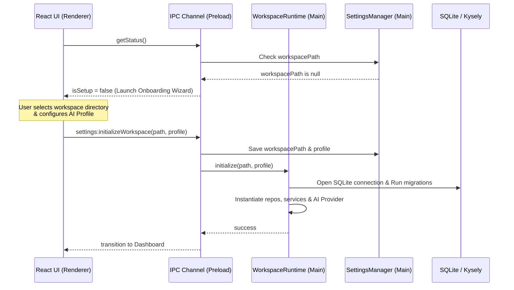

# ADR-017: Workspace Lifecycle Runtime and Configuration Onboarding

## Context

Originally, the SQLite database connection, migration executions, repository constructions, and AI generations were initialized immediately at Electron application startup in `main/index.ts`. All data was stored in a hardcoded path inside the OS user-data directory (`app.getPath('userData')/forge.db`).

To make Forge portable, workspaces need to be self-contained (storing their databases inside a local `<workspace-path>/.forge/forge.db` folder). This introduces a dynamic lifecycle challenge:

1. **Uninitialized State:** If no workspace path is configured, the application cannot construct database pools or repositories at startup.
2. **Workspace Switching:** When a user switches workspaces, the application must swap the database connection, clear caches, re-instantiate repositories/services, and broadcast updates without leaving dangling connections or stale references.
3. **Pluggable AI Backend:** The app must support multiple interchangeable local and cloud AI providers (OpenAI, Gemini, Ollama, LM Studio) and dynamically configure model selections via connection latency audits.

## Decision

We have implemented the following architectural changes:

1. **Dedicated `WorkspaceRuntime` Lifecycle Service:**
   - Introduced a central runtime service container responsible for initializing database adapters, running migrations, registering capability packs, and starting services.
   - Decoupled Electron startup in `main/index.ts` from database initialization.

2. **Full Runtime Rebuild on Workspace Switch:**
   - Swapping workspaces now performs a complete backend reset: aborting running AI generation streams, disposing of existing services/repositories, closing active SQLite/Kysely pools, initializing the target SQLite database, applying migrations, re-instantiating services, and telling the renderer to reload its state.

3. **Separation of Persistent Configuration:**
   - Introduced `SettingsManager` which strictly handles reading, writing, and version-migrating `settings.json` in the user-data folder. It maintains multiple AI profile credentials but is entirely decoupled from the active runtime instances.

4. **Onboarding Guardrail Wizard:**
   - Startup calls query configuration state. If `workspacePath` is unconfigured, the Electron process boots in a setup state and forces the React UI to display the Onboarding Wizard, blocking the main interface.

5. **Type-Safe Pluggable AI Providers:**
   - AI provider adapters implement `IAIProvider` with type-safe capability flags (`supportsStreaming`, `supportsToolCalling`, `supportsVision`, `supportsReasoning`) and dynamic model-listing queries instead of generic string maps. Mappings are decoupled using a registry `providerId` inside `AIProviderFactory`.

## Consequences

- **Portability:** Moving `forge.db` inside the selected workspace folder makes the entire project repository self-contained and portable (it can be backed up or committed to git).
- **Robustness:** Fully rebuilding the runtime container on workspace changes guarantees no state leakage or memory leaks from dangling database connections.
- **Onboarding UX:** Users are prevented from using the application in an unconfigured state, removing setup friction.
- **Extensibility:** Registering new providers requires zero UI or type modifications; they simply plug in as another `providerId` mapping in `AIProviderFactory` and describe their capability flags.
