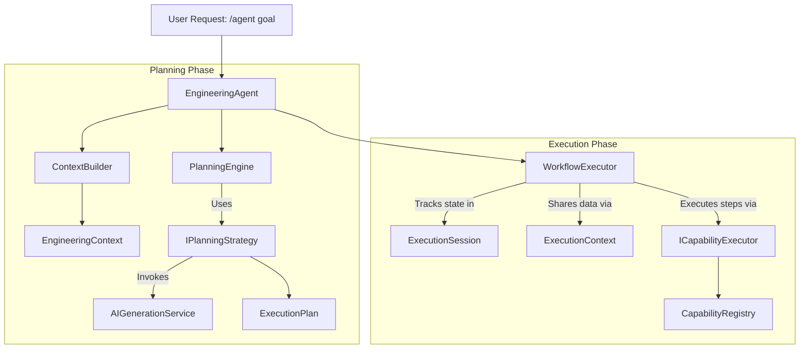

<!-- Source: documentation-engineering | Phase 15 | Date: 2026-07-03 -->
<!-- Last updated: 2026-07-03 -->

# Agent Orchestration Pipeline

As part of Milestone 9, Forge transitioned from providing isolated AI capabilities to an orchestrated agent model. This document serves as the architectural source of truth for the Agent Orchestration Layer.

## 1. Overall Orchestration Pipeline

The execution of a long-running goal follows a strict, unidirectional pipeline:

## 2. Component Responsibilities and Boundaries

* **`EngineeringAgent`**: The coordinator. It does not execute logic itself. It delegates context building, planning, and execution to the appropriate engines and bridges the output to a reactive event stream for the UI.
* **`PlanningEngine`**: Responsible exclusively for transforming a Goal and an `EngineeringContext` into a structured `ExecutionPlan`. It delegates the actual strategy (e.g., AI vs rule-based) to `IPlanningStrategy`.
* **`WorkflowExecutor`**: A state machine that iterates over an `ExecutionPlan`. It knows nothing about AI. It tracks progress, handles failures, and executes capabilities through `ICapabilityExecutor`.
* **`AIGenerationService`**: The low-level abstraction over LLM providers (OpenAI, Ollama, etc.). It handles prompt assembly, streaming, and tool schemas. It is purely stateless regarding application workflows.

## 3. Data Models

To prevent state leakage and ensure reproducibility, orchestration data is strictly separated:

* **`EngineeringContext`**: An immutable snapshot of the workspace (files, artifacts, dependencies) at the *start* of the planning phase.
* **`ExecutionPlan`**: An immutable blueprint generated by the planner. It defines *what* should happen (a list of `ExecutionStep`s) but contains no runtime state.
* **`ExecutionSession`**: A mutable entity that tracks *what is currently happening*. It contains the current status (Started, Completed, Failed), retry counts, and references the active step.
* **`ExecutionContext`**: A mutable runtime map used to share variables and outputs between steps during execution.

## 4. Extension Points

The architecture is designed to be extended without modifying core orchestration logic:

* **`IPlanningStrategy`**: New ways to plan (e.g., a fast heuristic planner vs a deep-thinking O1 planner) can be injected here.
* **`IContextProvider`**: Custom logic to gather context before planning can be added by implementing this interface and registering it with `ContextBuilder`.
* **`ICapabilityExecutor`**: Abstracts how capabilities are actually run. `LocalCapabilityExecutor` runs them in-process, but future implementations could run them in sandboxed WebWorkers or remote servers.

## 5. Adding New Capabilities

**CRITICAL:** New milestones should extend the platform by introducing capabilities and workflows, not by creating alternative execution paths or replacing the orchestration pipeline.

To add a new capability:
1. Create a class implementing `ICapability`.
2. Register it in the `CapabilityRegistry`.
3. The `EngineeringAgent` and `PlanningEngine` will automatically discover it, expose its schema to the LLM, and execute it when requested in an `ExecutionPlan`.

Do not bypass the orchestration layer by calling `AIGenerationService` directly for complex tasks.
