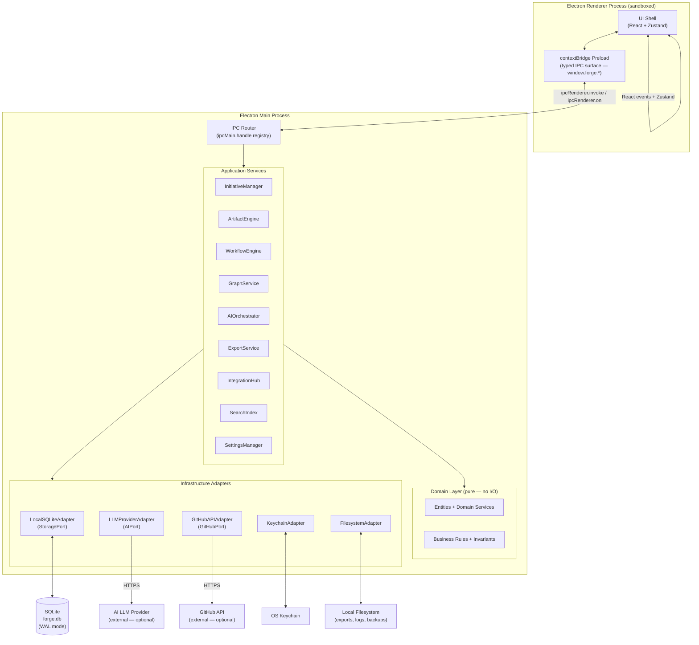

<!-- Source: system-design skill | Phase 6 | Date: 2026-07-02 -->
<!-- Last updated: 2026-07-02 -->

# Runtime Architecture Diagram

This diagram shows Forge's two Electron processes, the adapter layer, and all external systems — as they exist at runtime.

See [../architecture/system-context.md](../architecture/system-context.md) for the external C4 context view.  
See [../architecture/component-list.md](../architecture/component-list.md) for component responsibilities.

---

## Runtime Component Flow



---

## Process Boundary Summary

| Boundary | Mechanism | Direction |
|----------|-----------|-----------|
| Renderer ↔ Main | `contextBridge` + `ipcRenderer.invoke` | Bidirectional (request/response) |
| Main ↔ SQLite | `better-sqlite3` synchronous API | Read/Write |
| Main ↔ AI Provider | HTTPS (async Promise) | Outbound only |
| Main ↔ GitHub API | HTTPS (async Promise) | Outbound only |
| Main ↔ OS Keychain | `keytar` platform API | Read/Write |
| Main ↔ Filesystem | Node.js `fs` module | Read/Write |

---

## Trust Boundary at a Glance

```
[Renderer — lower trust]
    ↓ contextBridge only (no Node.js)
[Main Process — trusted]
    ↓ direct access
[SQLite, OS Keychain, Filesystem]
```

The renderer cannot reach SQLite, the OS Keychain, or the filesystem directly. Every operation is mediated by the typed IPC bridge. See [../architecture/security-model.md](../architecture/security-model.md).
