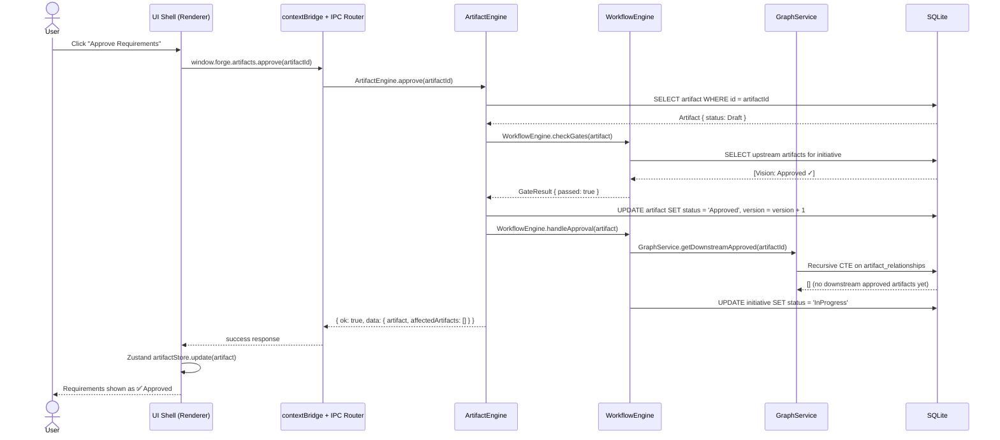
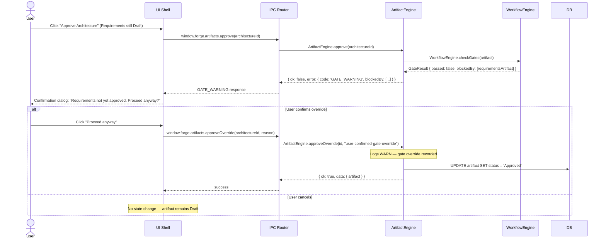
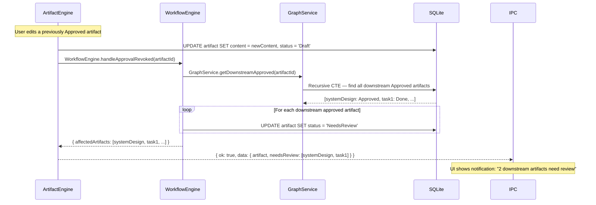
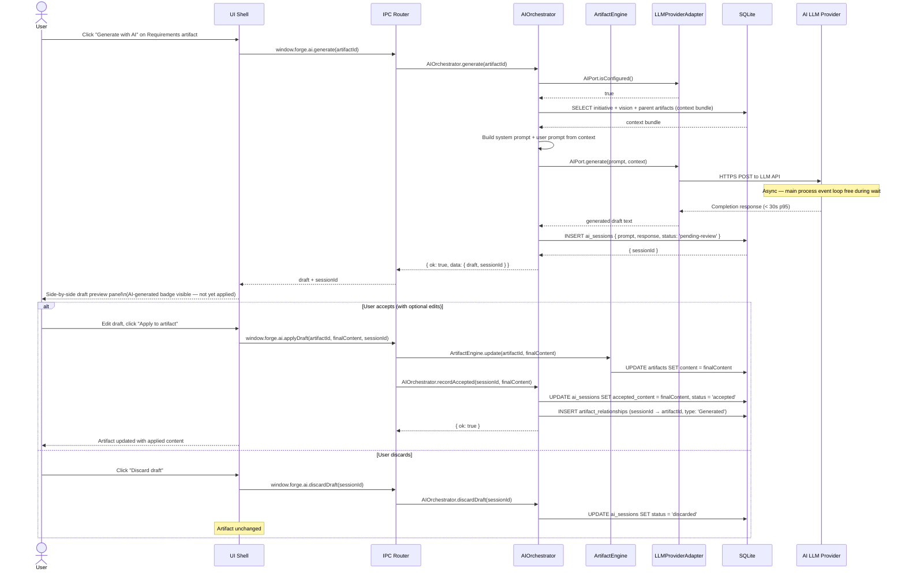
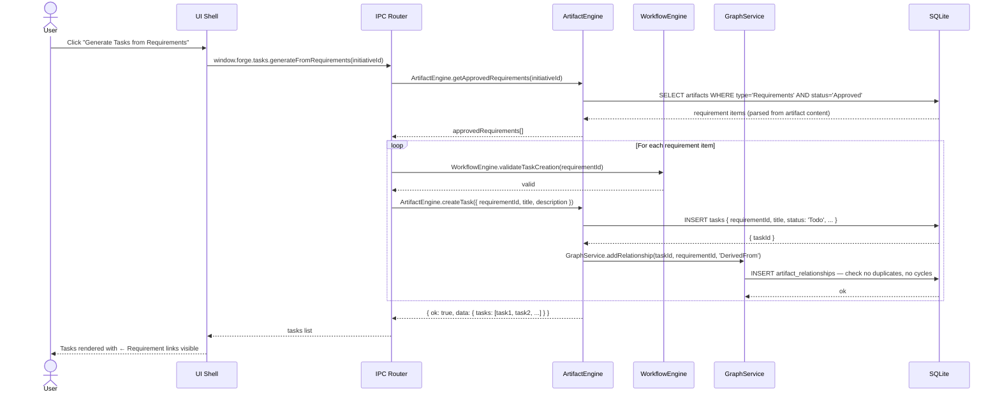
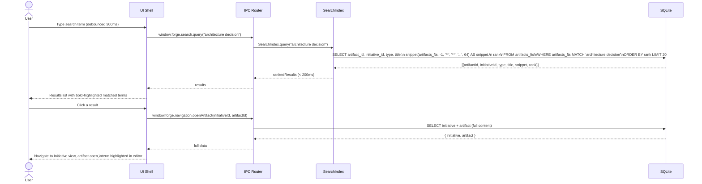

<!-- Source: system-design skill | Phase 6 | Date: 2026-07-02 -->
<!-- Last updated: 2026-07-02 -->

# Data Flow & Request Lifecycle

Four critical workflows traced end-to-end through Forge's runtime architecture.

See [architecture-diagram.md](architecture-diagram.md) for the component runtime diagram.  
See [component-breakdown.md](component-breakdown.md) for storage schema and state management.

---

## Workflow 1: Artifact Approval with Gate Check

The core Forge workflow. Example: approving the Requirements artifact.



### Gate Warning Variant (upstream not yet approved)



### NeedsReview Cascade (editing an approved artifact)



---

## Workflow 2: AI-Assisted Content Generation



### AI Provider Unavailable Path

```
AIPort.isConfigured() → false
  → Return { ok: false, error: { code: 'AI_NOT_CONFIGURED' } }
  → UI shows: "Configure an AI provider in Settings to use this feature"
  → Deep-link button to Settings > AI Configuration
  → Artifact editor remains fully usable without AI
```

---

## Workflow 3: Task Generation from Requirements



---

## Workflow 4: Full-Text Search



### Auto-Save Flow (background — not user-initiated)

```
User types in artifact editor
  → onChange → marks isDirty = true in uiStore
  → 500ms debounce resets on each keystroke
  → After 500ms silence:
      UI → IPC: window.forge.artifacts.update(artifactId, content)
      Main: ArtifactEngine.update(id, content)
        → SQLite: UPDATE artifacts SET content = ?, updated_at = ?
        → FTS5 trigger fires: UPDATE artifacts_fts SET content = ?
      IPC → UI: { ok: true, updatedAt }
      UI: isDirty = false, show "Saved ✓" indicator
```
